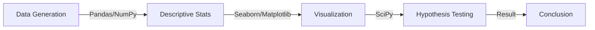

# Statistics & Data Analysis with Python

## Project Overview

This project serves as a comprehensive guide to performing **Descriptive** and **Inferential Statistics** using Python. It bridges the gap between raw data and actionable insights by demonstrating key statistical concepts and techniques.

The project covers the entire analysis lifecycle: from generating synthetic data to visualizing distributions and performing hypothesis testing to validate findings.

---

## Tech Stack

| Component | Technology | Description |
|---|---|---|
| **Data Manipulation** | Pandas, NumPy | Essential libraries for handling structured data and numerical operations. |
| **Visualization** | Matplotlib, Seaborn | Tools for creating static, animated, and interactive visualizations. |
| **Statistics** | SciPy | Library for scientific computing and technical computing, used here for hypothesis testing. |

---

## Workflow



---

## Key Concepts Covered

### 1. Descriptive Statistics
- **Central Tendency**: Mean, Median, Mode.
- **Dispersion**: Standard Deviation, Variance, IQR.
- **Distribution Shape**: Skewness, Kurtosis.

### 2. Data Visualization
- **Histograms**: To view data distribution and check for normality.
- **Boxplots**: To identify outliers and compare distributions across groups.

### 3. Inferential Statistics
- **T-Test**: Comparing the means of two independent groups (e.g., Income by Gender) to determine if differences are statistically significant.

---

## Setup & Installation

### 1. Prerequisites
- Python 3.8+
- Jupyter Notebook

### 2. Install Dependencies
```bash
pip install pandas numpy matplotlib seaborn scipy
```

---

## Usage

Open `Statistics_DataAnalysis_with_Python.ipynb` in Jupyter Notebook.

1.  **Run Cells**: Execute the cells sequentially.
2.  **Explore**: Modify the synthetic data generation parameters to see how it affects the results.
3.  **Analyze**: Interpret the P-values from the hypothesis tests to draw conclusions.

---

## Contact

**Author:** Akbar Basha
**GitHub:** [@AkbarDev](https://github.com/AkbarDev)
